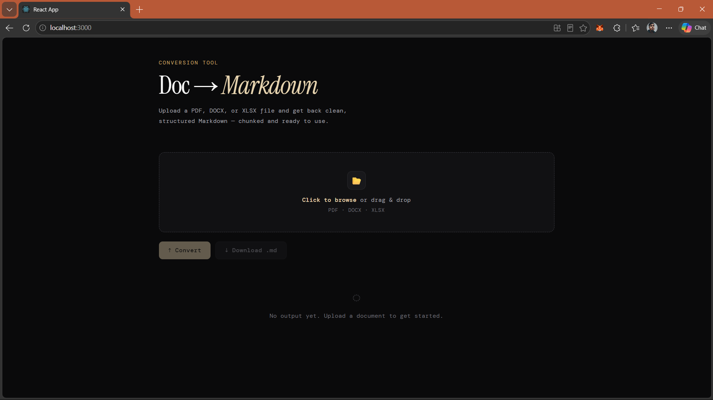
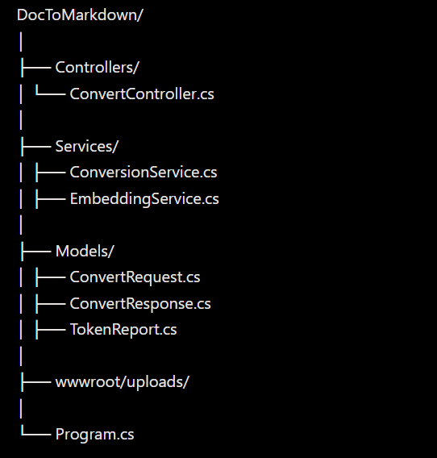

📄 Doc → Markdown AI Tool

An AI-powered document processing system that converts PDF, DOCX, and XLSX files into clean, structured Markdown — optimized for LLM usage, token efficiency, and scalable AI pipelines.

---

🚀 Features

🔹 Multi-Format Document Conversion

- Convert:
  - PDF → Markdown (⚡ batch processing for large files)
  - DOCX → Markdown
  - XLSX → Markdown
- Uses:
  - Poppler (pdftotext) for PDFs
  - Pandoc for DOCX/XLSX

---

🔹 Large PDF Support 🔥

- Handles 100+ page documents
- Page-wise batch processing (no crashes)
- Memory-efficient pipeline
- Scalable architecture for real-world use

---

🔹 Advanced Cleaning Engine

- Removes:
  - Extra spaces & line breaks
  - Page numbers
  - References section
  - Citations "[1]", "(2024)"
  - Figure & table captions
  - Repeated noisy lines
- Produces clean, normalized Markdown

---

🔹 AI Compression Mode 🔥 (Core Feature)

- Optional toggle (UI-controlled)
- Reduces tokens by:
  - Removing filler words
  - Deduplicating sentences
  - Simplifying structure
- Trade-off:
  - ⚡ Lower token usage
  - ⚠️ Slight wording changes

👉 Perfect for LLM input optimization

---

🔹 Token Optimization Analytics

- Tracks:
  - Original token count
  - Cleaned token count
  - Tokens saved
  - Reduction %
- Helps reduce:
  - API cost 💸
  - LLM latency ⚡

---

🔹 AI Chunking System

- Splits content into smaller chunks
- Optimized for:
  - GPT / LLM input
  - RAG pipelines
  - Embeddings

---

🔹 Modern UI (React)

- Clean dark-mode interface
- Features:
  - Drag & drop upload
  - AI mode toggle 🔥
  - Token analytics dashboard
  - Chunk viewer
  - Full Markdown preview
  - Download ".md" file

---

🧠 Why This Project?

Large documents waste tokens when used with AI systems.

This tool:

- Cleans unnecessary content
- Reduces token usage dramatically
- Prepares documents for LLM pipelines

👉 Ideal for:

- Chat with PDF systems
- Knowledge base apps
- AI search & RAG systems
- LLM preprocessing pipelines

---

🖥️ UI Preview

---

🛠️ Tech Stack

🔹 Backend

- ASP.NET Core (.NET 9)
- C#
- REST API
- Swagger

🔹 Processing Tools

- Pandoc (DOCX/XLSX → Markdown)
- Poppler ("pdfinfo", "pdftotext") for PDF
- Regex-based AI cleaning engine

🔹 Frontend

- React.js
- Axios
- React Markdown
- Custom UI (dark theme)

---

📦 Project Structure

---

⚙️ Installation & Setup

🔹 Backend (ASP.NET Core)

cd DocToMarkdown
dotnet restore
dotnet build
dotnet run

API:

https://localhost:7286

Swagger:

https://localhost:7286/swagger

---

🔹 Frontend (React)

cd doc-ui
npm install
npm start

Runs at:

http://localhost:3000

---

⚠️ Requirements

Make sure you install:

🔹 Pandoc

https://pandoc.org/installing.html

🔹 Poppler (for PDF processing)

https://github.com/oschwartz10612/poppler-windows/releases

👉 Add to PATH:

C:\poppler\Library\bin

---

🔥 API Example

Request (multipart/form-data):

- "file": document file
- "enableAICompression": true / false

---

Response:

{
  "fileName": "document.pdf",
  "markdownContent": "...",
  "chunks": ["chunk1", "chunk2"],
  "tokenReport": {
    "originalTokens": 12000,
    "cleanedTokens": 8500,
    "reductionPercent": 29.16,
    "tokensSaved": 3500
  },
  "totalPages": 88,
  "processedBatches": 9
}

---

💥 Key Highlights

- ⚡ Handles large PDFs efficiently
- 🧠 AI-optimized text compression
- 💸 Reduces LLM costs significantly
- 🧩 Ready for RAG & embeddings
- 🎯 Clean, production-style architecture

---

🚀 Future Improvements

- AI summarization per chunk
- Real-time progress tracking
- Side-by-side comparison (AI vs Normal)
- Semantic deduplication
- Embedding generation & storage

---

📌 Conclusion

This is not just a file converter.

👉 It’s a complete AI document preprocessing pipeline
built for real-world LLM applications.

---
